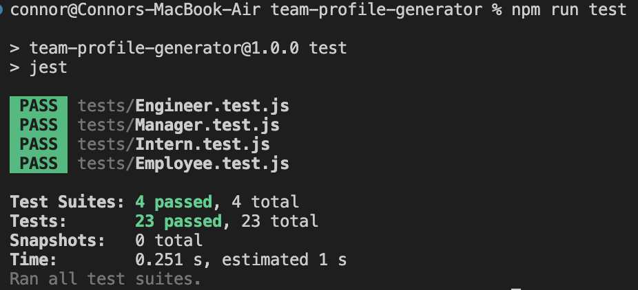
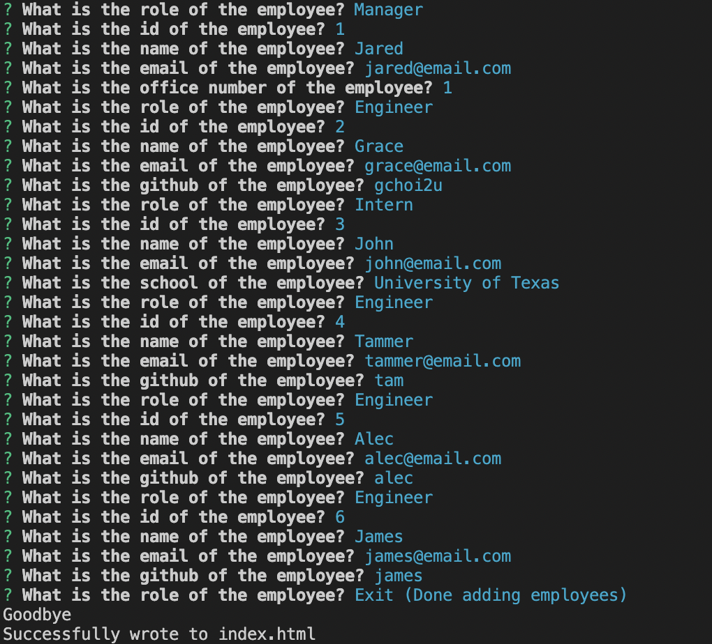
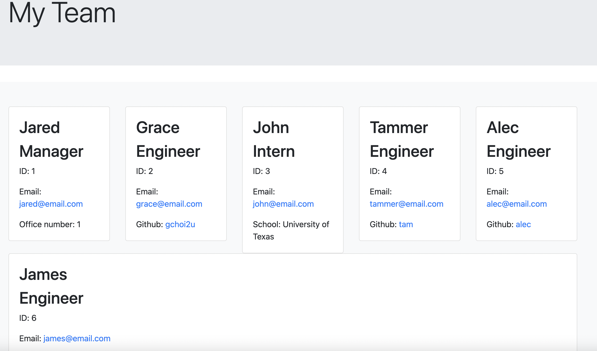

# team-profile-generator
Use the terminal to set up a webpage using including employees and links to their email or github pages based on their role.

Uses npm iquirer for prompts and jest for tests.

To run the CLI navigate to the root directory and type "node index.js". An index .html file will be generated in the dist/ folder. The current repo has an example index.html generated using the CLI in the dist/ folder.

## Image of passing tests

## Image of example webpage setup using terminal

## Image of option list for employee role

## Sample Image of Page
